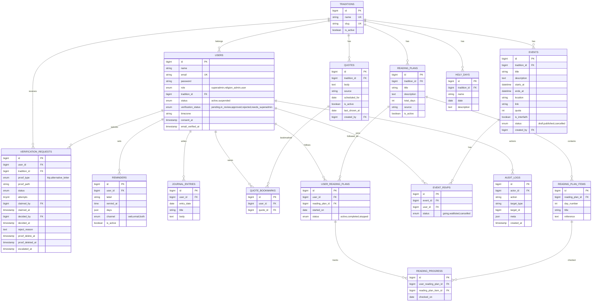

# DB & Backend: Grace

Engine: MySQL 8 (InnoDB), charset `utf8mb4`.

---

## Bagian A: Database

### A.1 ERD



### A.2 Detail Tabel

#### traditions
`id, name (unique), slug (unique), is_active, timestamps`
Seed: Kristen Protestan, Kristen Katolik, Buddha, Hindu, Konghucu, Islam.

#### users
| Kolom | Tipe | Catatan |
|---|---|---|
| role | enum(`superadmin`,`religion_admin`,`user`) | default `user` |
| tradition_id | FK null | wajib untuk `religion_admin` dan `user`; null untuk superadmin |
| status | enum(`active`,`suspended`) | |
| verification_status | enum | khusus `user`; `approved` untuk selainnya |
| timezone | varchar(40) | default `Asia/Jakarta` |
| consent_at | timestamp null | waktu persetujuan privasi |
| email, password, name, email_verified_at, timestamps | | |

Index: `email` (unique), `(role, tradition_id)`, `(tradition_id, verification_status)`.

#### verification_requests
| Kolom | Catatan |
|---|---|
| user_id, tradition_id | FK |
| proof_type | `ktp` atau `alternative_letter` |
| proof_path | path file terenkripsi; null setelah dihapus |
| status | `pending, in_review, approved, rejected, needs_superadmin` |
| attempts | jumlah percobaan (maks 3) |
| claimed_by, claimed_at | lock reviewer |
| decided_by, decided_at, reject_reason | hasil keputusan |
| proof_delete_at / proof_deleted_at | jadwal dan realisasi penghapusan |
| escalated_at | waktu naik ke superadmin |

Index: `(tradition_id, status)`, `(status, created_at)`, `(user_id)`.
Catatan: **tidak ada kolom NIK**.

#### quotes
`tradition_id, body, source (wajib), scheduled_for (date null), is_active, last_shown_at, created_by`
Index: `(tradition_id, scheduled_for)`, `(tradition_id, is_active, last_shown_at)`.

#### reading_plans / reading_plan_items
Plan: `tradition_id, title, description, total_days, source, is_active`.
Item: `reading_plan_id, day_number, title, reference`. Unique: `(reading_plan_id, day_number)`.
(Hanya menyimpan **rujukan** bacaan, bukan teks kitab, untuk menghindari masalah hak cipta.)

#### user_reading_plans / reading_progress
`user_reading_plans`: `user_id, reading_plan_id, started_on, status`.
`reading_progress`: `user_reading_plan_id, reading_plan_item_id, checked_on`. Unique: `(user_reading_plan_id, reading_plan_item_id)`. Index: `(user_reading_plan_id, checked_on)`.

#### reminders
`user_id, label, remind_at (time), days (json, hari dalam minggu), channel, is_active`. Index: `(is_active, remind_at)`.

#### holy_days
`tradition_id, name, date, description`. Index: `(tradition_id, date)`.

#### events
`tradition_id, title, description, starts_at, ends_at, location, link, quota (null = tanpa batas), is_interfaith, status, created_by`.
Index: `(status, starts_at)`, `(tradition_id, starts_at)`, `(is_interfaith, starts_at)`.

#### event_rsvps
`event_id, user_id, status (going|waitlisted|cancelled)`. Unique: `(event_id, user_id)`.

#### journal_entries
`user_id, entry_date, title, body`. Index: `(user_id, entry_date)`. Hanya pemilik yang dapat membaca.

#### audit_logs
`actor_id, action, target_type, target_id, meta (json), created_at`. Index: `(actor_id, created_at)`, `(target_type, target_id)`.
Contoh `action`: `verification.approve`, `verification.reject`, `proof.view`, `admin.create`, `settings.update`.

#### settings
| key | default |
|---|---|
| `proof_retention_days` | 7 |
| `max_verification_attempts` | 3 |
| `escalate_after_days` | 3 |
| `rest_days_per_week` | 1 |
| `default_timezone` | Asia/Jakarta |

#### Tabel bawaan Laravel
`password_reset_tokens`, `sessions`, `jobs`, `failed_jobs`, `notifications`, `cache`.

### A.3 Relasi Eloquent

```php
Tradition      hasMany User, Quote, ReadingPlan, Event, HolyDay, VerificationRequest
User           belongsTo Tradition; hasMany VerificationRequest, Reminder, JournalEntry,
               QuoteBookmark, UserReadingPlan, EventRsvp
ReadingPlan    belongsTo Tradition; hasMany ReadingPlanItem, UserReadingPlan
UserReadingPlan belongsTo User, ReadingPlan; hasMany ReadingProgress
Event          belongsTo Tradition; hasMany EventRsvp
```

---

## Bagian B: Backend

### B.1 Route: User (`/app`), butuh `verified.faith`

| Method | URI | Controller@aksi | Fungsi |
|---|---|---|---|
| GET | `/app` | DashboardController@index | Beranda |
| GET | `/app/quotes/today` | QuoteController@today | Kutipan hari ini |
| POST | `/app/quotes/{quote}/bookmark` | QuoteController@bookmark | Simpan/hapus bookmark |
| GET | `/app/reading-plans` | ReadingController@index | Daftar rencana |
| POST | `/app/reading-plans/{plan}/start` | ReadingController@start | Mulai rencana |
| POST | `/app/reading/{item}/check` | ReadingController@check | Centang butir |
| GET/POST | `/app/reminders` | ReminderController | Atur pengingat |
| DELETE | `/app/reminders/{reminder}` | ReminderController@destroy | Hapus |
| GET | `/app/events` | EventController@index | Jelajah event |
| GET | `/app/events/{event}` | EventController@show | Detail |
| POST | `/app/events/{event}/rsvp` | EventController@rsvp | RSVP |
| DELETE | `/app/events/{event}/rsvp` | EventController@cancel | Batal RSVP |
| GET | `/app/holy-days` | HolyDayController@index | Kalender hari raya |
| Resource | `/app/journal` | JournalController | Jurnal pribadi |

### B.2 Route: Pendaftaran & Status (tanpa `verified.faith`)

| Method | URI | Fungsi |
|---|---|---|
| GET/POST | `/register` | Daftar + unggah bukti |
| GET | `/verification/status` | Status verifikasi |
| POST | `/verification/resubmit` | Unggah ulang setelah ditolak |

### B.3 Route: Admin Agama (`/admin`)

| Method | URI | Fungsi |
|---|---|---|
| GET | `/admin` | Ringkasan tradisi |
| GET | `/admin/verifications` | Antrean (tradisinya) |
| POST | `/admin/verifications/{v}/claim` | Klaim untuk ditinjau |
| GET | `/admin/verifications/{v}/proof` | Lihat bukti (dicatat) |
| POST | `/admin/verifications/{v}/approve` | Setujui |
| POST | `/admin/verifications/{v}/reject` | Tolak + alasan |
| Resource | `/admin/quotes` | CRUD kutipan |
| Resource | `/admin/reading-plans` | CRUD rencana + butir |
| Resource | `/admin/events` | CRUD event |
| GET | `/admin/events/{event}/attendees` | Peserta |
| Resource | `/admin/holy-days` | CRUD hari raya |
| GET | `/admin/members` | Daftar user tradisinya |
| POST | `/admin/members/{user}/toggle` | Suspend/aktifkan |

### B.4 Route: Superadmin (`/superadmin`)

| Method | URI | Fungsi |
|---|---|---|
| GET | `/superadmin` | Ringkasan sistem |
| Resource | `/superadmin/religion-admins` | Kelola akun admin agama |
| Resource | `/superadmin/traditions` | Kelola tradisi |
| GET | `/superadmin/verifications` | Antrean semua tradisi |
| POST | `/superadmin/verifications/{v}/approve` / `reject` | Putuskan/ambil alih |
| GET | `/superadmin/verifications/{v}/proof` | Lihat bukti (dicatat) |
| GET | `/superadmin/audit-logs` | Audit log |
| GET/PUT | `/superadmin/settings` | Pengaturan |
| GET | `/superadmin/health` | Status queue, scheduler, job gagal |

### B.5 Aturan Validasi (ringkas)

| Form | Aturan utama |
|---|---|
| Registrasi | `name`, `email` unik, `password` min 8, `tradition_id` exists, `proof_type` in (ktp, alternative_letter), `proof_file` mimes jpg,png,pdf max 4 MB, `consent` accepted |
| Tolak verifikasi | `reason` required min 10 karakter |
| Kutipan | `body` required, `source` required, `scheduled_for` date unik per tradisi (opsional) |
| Rencana bacaan | `title`, `total_days` 1-365; butir: `day_number` unik, `reference` required |
| Event | `title`, `starts_at` future, `ends_at` ≥ `starts_at`, `quota` null atau ≥ 1 |
| Pengingat | `remind_at` format H:i, `days` array 1-7, `channel` in (web, email, both) |
| Jurnal | `entry_date` date, `body` required |

### B.6 Service dan Tanggung Jawabnya

| Service | Method utama | Catatan |
|---|---|---|
| `VerificationService` | `submit`, `claim`, `approve`, `reject`, `escalate` | Cek tradisi reviewer; `reject` menaikkan `attempts` |
| `ProofStorageService` | `store`, `stream`, `purge` | Enkripsi, disk privat, catat akses |
| `DailyQuoteService` | `forUser($user, $date)` | Terjadwal dulu, lalu rotasi |
| `ReadingProgressService` | `check`, `streak`, `percent` | Hari jeda 1x per minggu |
| `ReminderService` | `due($now)`, `send` | Hitung per zona waktu |
| `EventService` | `rsvp`, `cancel`, `promoteWaitlist` | `lockForUpdate` |
| `AuditLogger` | `log($actor, $action, $target, $meta)` | Dipanggil di setiap aksi penting |

### B.7 Contoh Kode Kunci

**Global scope tradisi**
```php
class TraditionScope implements Scope
{
    public function apply(Builder $builder, Model $model): void
    {
        $user = auth()->user();
        if ($user && $user->role === Role::ReligionAdmin) {
            $builder->where($model->getTable().'.tradition_id', $user->tradition_id);
        }
    }
}
```

**Penentuan pengingat jatuh tempo (per zona waktu)**
```php
Reminder::where('is_active', true)->with('user')->get()
    ->filter(function ($r) use ($now) {
        $local = $now->copy()->timezone($r->user->timezone);
        return in_array($local->dayOfWeekIso, $r->days)
            && $local->format('H:i') === substr($r->remind_at, 0, 5);
    });
```

**RSVP dengan kuota**
```php
DB::transaction(function () use ($event, $user) {
    $event = Event::whereKey($event->id)->lockForUpdate()->first();
    $going = $event->rsvps()->where('status', 'going')->count();
    $status = ($event->quota === null || $going < $event->quota) ? 'going' : 'waitlisted';
    EventRsvp::updateOrCreate(['event_id' => $event->id, 'user_id' => $user->id], ['status' => $status]);
});
```

### B.8 Events dan Notifikasi

| Event | Penerima | Isi |
|---|---|---|
| `VerificationSubmitted` | Admin tradisi | Ada pendaftar baru |
| `VerificationApproved/Rejected` | User | Hasil + alasan |
| `VerificationEscalated` | Superadmin | Antrean naik |
| `ReminderDue` | User | Waktunya membaca/berdoa/meditasi |
| `HolyDayApproaching` | User tradisi terkait | H-7 / H-1 |
| `EventPublished` / `EventReminder` | User tradisi terkait | Info dan H-1 |
| `WaitlistPromoted` | User | Kamu mendapat tempat |

### B.9 Seeder Demo

- 1 superadmin (`superadmin@grace.test`)
- 6 admin agama, satu per tradisi (`admin.islam@grace.test`, dst.)
- 12 user contoh (beberapa `pending`, `rejected`, `approved`) dengan **bukti dummy**
- 10 kutipan per tradisi (bersumber jelas, domain publik/karya sendiri)
- 2 rencana bacaan per tradisi dengan butir contoh (rujukan saja)
- Hari raya, beberapa event (termasuk 1-2 lintas iman), pengaturan default

### B.10 Catatan Desain

- **Mengapa `tradition_id` + global scope + policy?** Dua lapis agar kebocoran lintas tradisi sulit terjadi.
- **Mengapa hanya menyimpan rujukan bacaan?** Menghindari isu hak cipta terjemahan kitab.
- **Mengapa bukti dihapus otomatis?** Meminimalkan dokumen identitas yang tersimpan.
- **Mengapa jurnal tidak terlihat admin?** Itu catatan pribadi rohani; tidak ada kebutuhan bisnis untuk membacanya.
- **Mengapa ada `needs_superadmin`?** Mencegah user terjebak di antrean yang tidak diproses.
